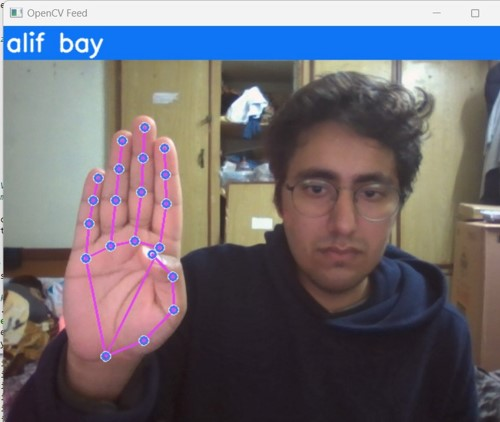

# Pakistan Sign Language Recognition using Computer Vision

With 5% of any country's population experiencing hearing impairment, there is a crucial need for a national sign language interpreter. To address this, we've developed a PSL Interpreter that employs computer vision technology to convert sign language into text with just a camera. 
Built for our "Introduction to Computer Vision" course, under the supervision of Dr. Naeem Akhtar

## Usage

Fork this repository. Change path to model accordingly in Module 9. Save Weights. Run the code block after module 10 to test our model using real-world data!

## Output

## Training accuracy visualization

## Collaboraters 

[Muhammad Hassaan Ibrahim](https://www.linkedin.com/in/hassaanibrahim/)
[Abbas Bukhari](https://www.linkedin.com/in/muhammad-abbas-bukhari-7b0552233/)

